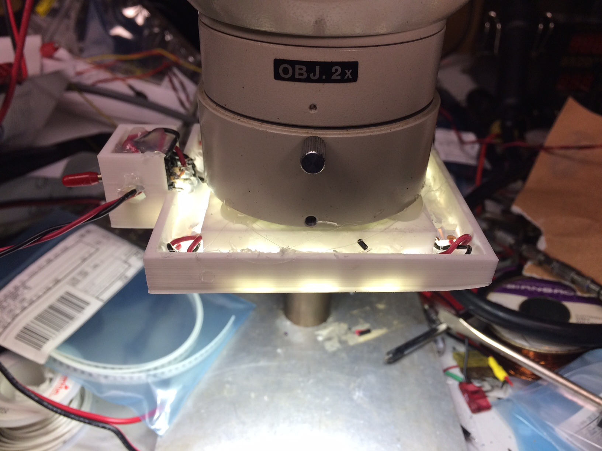
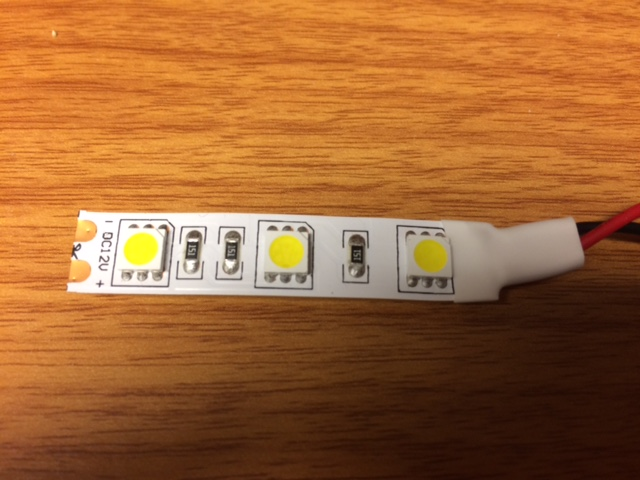

# Description:

  A widget that holds four 12V white LED strips on a ring
  that fits around the base of a Nikon binocular microscope
  with a 2.39 inch diameter ring.

  This is what it looks like on a microscope:

  .

  This is a "big" build for my Monoprice Select Mini.  It takes
  a while to print (more than four hours).  Note the slight warp
  on the corner at the right side of the image.  This doesn't
  interfere with the function, but it is a hint that bed heating
  is important. 

  It uses a three element LED strip that was cut off a reel that I
  bought surplus.

  

  See the top of the scad file to find the various parameters that
  can be adjusted to fit whatever LED strip you may have, and to
  fit the collar on your microscope. 

  The LED strips are held in place with hot melt glue, and the
  collar is held onto the scope body with the same.  (Moto:
  "Why use a screw, when you've got hot melt glue?")  Yes it is
  ugly, but my shop is for tinkering, not for gazing at.

# License:
See the [LICENSE.txt](LICENSE.txt) file for copyright and conditions for re-use.